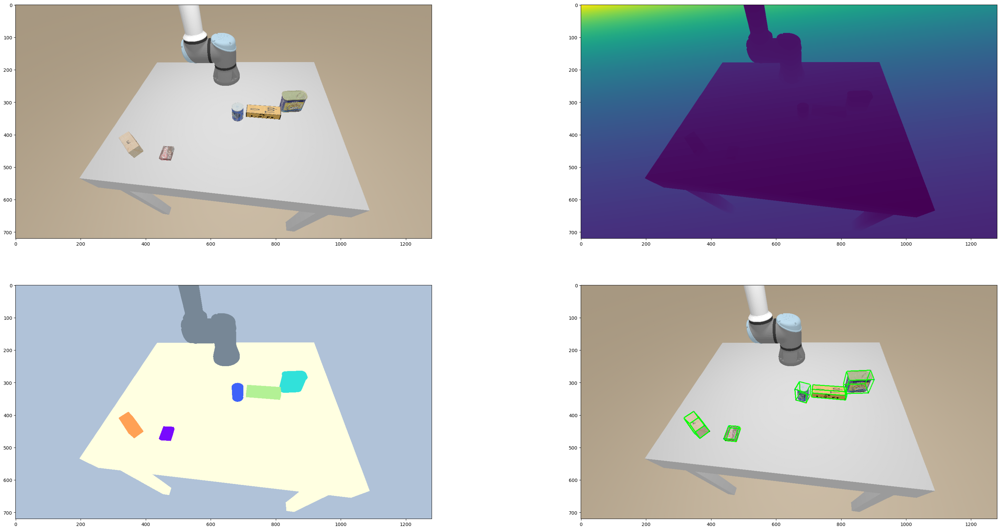

# Learning-based 6D Object Pose Estimation

See [report](./report.pdf) via this hyperlink.

## Data

There are 4 datasets: `./training_data`, `./testing_data`, `./testing_data final`, and `./model`. Which are all derived from [here](https://drive.google.com/drive/folders/196tuNaIivzsfsKOdrNy9tMrENJpMeFBW).

`./model` contains the superset of ground-truth canonical objects that are present in training/testing scenes. There are 79 objects in `./model`, but only 23 of them are present in train/test scenes

For each of the 23 objects in the scene, IFP (iterative-farthest-point) sampling is used to produce $M=1000$ keypoints. (See [the notebook](./3.1_target_point.ipynb) for detail).

## Visualization

# learning_based_pose
